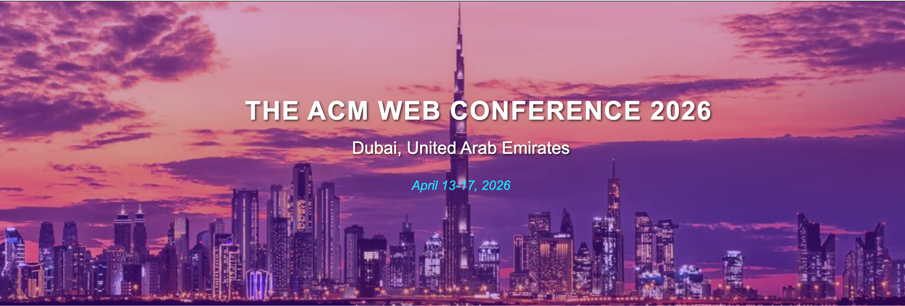

# Conference Name 2025

***

## Navigation

| [ABOUT](#about) | [CALL FOR PAPERS](#call-for-papers) | [IMPORTANT DATES](#important-dates) | [COMMITTEE](#committee) |
| --------------- | ----------------------------------- | ----------------------------------- | ----------------------- |

***

***

## ABOUT

这是一个 ABOUT 章节！这是一个 ABOUT 章节！

### Conference Overview

The International Conference on Technology and Innovation (ICT 2025) is dedicated to bringing together researchers, engineers, and practitioners from around the world to share the latest advancements in technology and innovation. Our goal is to promote academic exchange, showcase cutting-edge research, and facilitate collaboration among professionals in the field.

***

## CALL FOR PAPERS

We welcome contributions of both technical and perspective papers from a wide range of topics, including but not limited to the following topics of interest:

* **Multimodal Social Media Content Analysis with LMMs**

  This topic addresses the core technical challenges in understanding multimodal content on social media. Key issues include:

  * Multimodal Fusion: Developing effective strategies to integrate information from various modalities within LMMs.

  * Information Alignment: Aligning data from different modalities to maintain consistency in time, space, or semantics for a coherent understanding.

* **Performance and Safety Evaluation of LMMs for Social Media Deployment**

  This topic addresses the practical hurdles of deploying LMMs on public-facing platforms. Key areas include:

  * Performance Issues: Evaluating the quality of generated content and the model’s ability to follow complex instructions (instruction following).

  * Safety and Security Issues: Investigating and mitigating critical safety concerns such as model hallucinations, vulnerability to "jailbreak" attacks, and ensuring the generation of safe and appropriate content.

Submissions should be 4-8 pages long, excluding references, and must follow the new standard ACM conference proceedings template. The review process is single-blind, and assessed based on their novelty, technical quality, significance, clarity, and relevance regarding the workshop topics. An optional appendix of arbitrary length is allowed and should be put at the end of the paper (after references). All manuscripts should be submitted in a single PDF file including all content, figures, tables, references, and other information. All accepted papers will be posted on the workshop website.

For LaTeX users: unzip acmart.zip, make, and use sample-sigconf.tex as a template; Additional information about formatting and style files is available online at: 
[https://www.acm.org/publications/proceedings-template](https://www.acm.org/publications/proceedings-template)
https://www.acm.org/publications/proceedings-template

We will use EasyChair to manage the submission and peer-reviewing process for this workshop. Accepted papers will be presented as posters during the workshop and listed on the website. A small number of accepted papers will be selected to be presented as contributed talks (15-minute oral presentations). We also welcome submissions of unpublished papers, including those submitted/accepted to other venues if that other venue allows.

**Submission site: xxx**

***

## IMPORTANT DATES

| Event                          | Date              |
| ------------------------------ | ----------------- |
| **Paper Submission Deadline**  | February 28, 2025 |
| **Notification of Acceptance** | April 15, 2025    |
| **Camera-Ready Submission**    | May 15, 2025      |
| **Early Bird Registration**    | June 1, 2025      |
| **Conference Dates**           | July 10-12, 2025  |

*All dates are in 北京时间 (GMT+8)*

***

## COMMITTEE

### Organizing Committee

***

**Contact Information:**

Email: conference@example.com

Website: [https://conference.example.com](https://conference.example.com)

Twitter: @Conference2025

***

*© 2025 International Conference on Technology and Innovation. All rights reserved.*

> （注：文档部分内容可能由 AI 生成）
